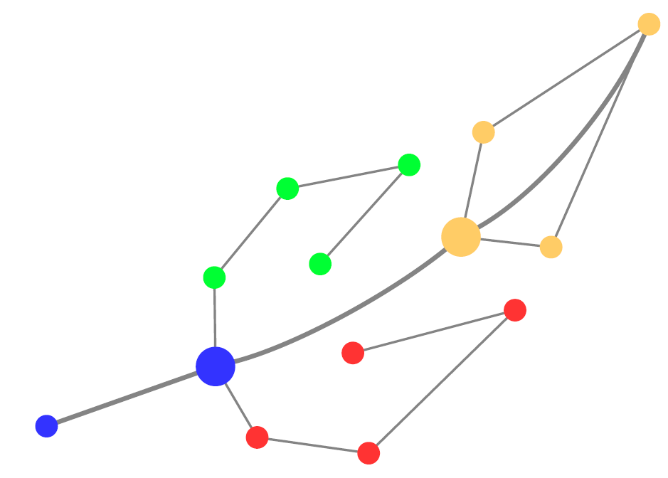

# PIUMA (Phenotypes Identification Using Mapper from topological data Analysis)  
Phenotyping is a process of characterizing and classifying individuals based on observable traits or phenotypic characteristics, such as the systematic analysis and measurement of various physical, physiological, and behavioral features of individuals. Phenotyping plays a crucial role in precision medicine as it provides essential data for understanding individual health characteristics and disease manifestations, by combining data from different sources to gain comprehensive insights into an individual’s health status and disease risk, to identify predictive markers, and to facilitate the development of personalized treatment strategies.
In this context, the application of unsupervised learning methodologies could help the identification of specific phenotypes in huge heterogeneous cohorts, such as clinical or -omics data.
Among them, the Topological Data Analysis (TDA) is a rapidly growing field that combines concepts from algebraic topology and computational geometry to analyze and extract meaningful information from complex and high-dimensional data sets. Moreover, TDA is a robust and effective methodology, able to preserve the intrinsic characteristics of data and the mutual relations among observations, depicting complex data in a graph-based representation.
The PIUMA package allows implementing all the main steps of a Topological Data Analysis in R environment.


## Installation
```{r, eval = FALSE}
# The easiest way to get PIUMA is to install devtools:
install.packages("devtools")

# and then, type:
devtools::install_github("BioinfoMonzino/PIUMA")
```


Mattia Chiesa, Laura Ballerini, Alessia Gerbasi, Giuseppe Albi, Arianna Dagliati and Luca Piacentini

