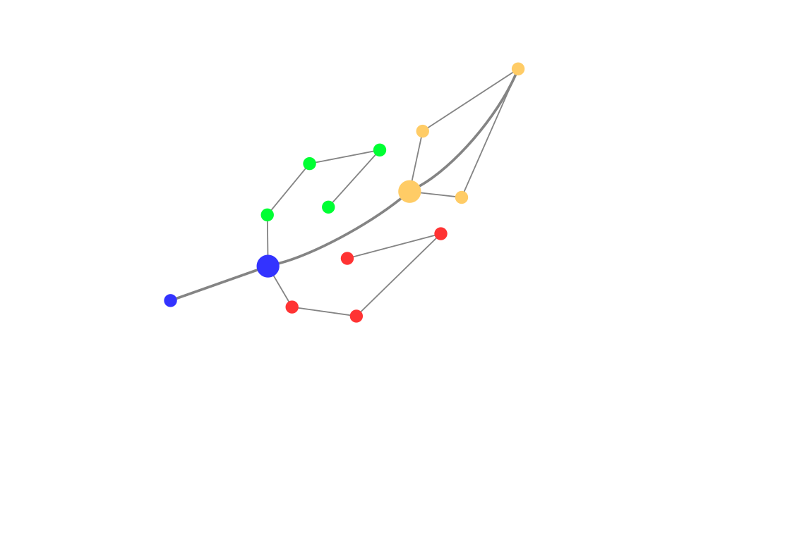
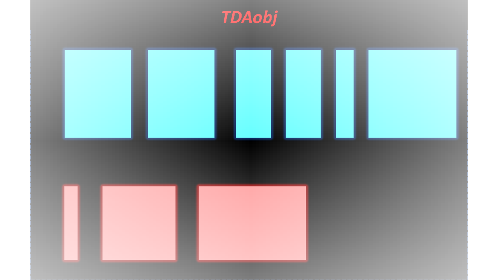
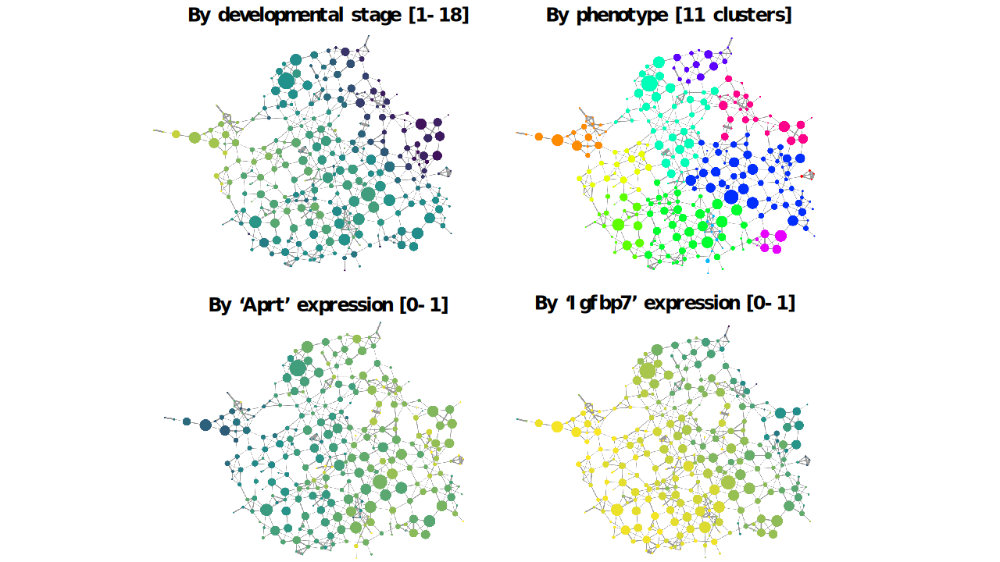

```{r, include=FALSE}
knitr::opts_chunk$set(
    collapse = TRUE,
    comment = "#>"
)
```



# Introduction

This guide provides an overview of the PIUMA [^1] package, a comprehensive R
package for performing Topological Data Analysis on high-dimensional datasets,
such as -omics data.

[^1]: PIUMA is the italian word for feather

## Motivation

Phenotyping is a process of characterizing and classifying individuals based on
observable traits or phenotypic characteristics. In the context of medicine and
biology, phenotyping involves the systematic analysis and measurement of various
physical, physiological, and behavioral features of individuals, such as height,
weight, blood pressure, biochemical markers, imaging data, and more. Phenotyping
plays a crucial role in precision medicine as it provides essential data for
understanding individual health characteristics and disease manifestations, by
combining data from different sources to gain comprehensive insights into an
individual's health status and disease risk. This integrated approach allows for
more accurate disease diagnosis, prognosis, and treatment selection. The same
considerations could be also be extended in omics research, in which the
expression values of thousands of genes and proteins, or the incidence of
somatic and germline polymorphic variants are usually assessed to link molecular
activities with the onset or the progression of diseases. In this field,
phenotyping is needed to identify patterns and associations between phenotypic
traits and a huge amount of available features. These analyses can uncover novel
disease subtypes, identify predictive markers, and facilitate the development of
personalized treatment strategies. In this context, the application of
unsupervised learning methodologies could help the identification of specific
phenotypes in huge heterogeneous cohorts, such as clinical or -omics data. Among
them, the Topological Data Analysis (TDA) is a rapidly growing field that
combines concepts from algebraic topology and computational geometry to analyze
and extract meaningful information from complex and high-dimensional data sets
[@carlsson2009topology]. Moreover, TDA is a robust and effective methodology
that preserves the intrinsic characteristics of data and the mutual
relationships among observations, by presenting complex data in a graph-based
representation. Indeed, building topological models as networks, TDA allows
complex diseases to be inspected in a continuous space, where subjects can
'fluctuate' over the graph, sharing, at the same time, more than one adjacent
node of the network [@dagliati2020using]. Overall, TDA offers a powerful set of
tools to capture the underlying topological features of data, revealing
essential patterns and relationships that might be hidden from traditional
statistical techniques [@casaclang2019network].

# Installation

PIUMA can be installed by:

```{r install-package, eval=FALSE}
if (!require("BiocManager", quietly = TRUE)) {
    install.packages("BiocManager")
}

BiocManager::install("PIUMA")
```

# Tutorial

## The testing dataset

We tested PIUMA on a subset of the single-cell RNA Sequencing dataset
([GSE:GSE193346](https://www.ncbi.nlm.nih.gov/geo/query/acc.cgi?acc=GSE193346)
generated and published by *Feng et al. (2022)* to demonstrate that distinct
transcriptional profiles are present in specific cell types of each heart
chambers, which were attributed to have roles in cardiac development
[@feng2022single]. In this tutorial, our aim will be to exploit PIUMA for
identifying sub-population of vascular endothelial cells, which can be
associated with specific heart developmental stages. The original dataset
consisted of three layers of heterogeneity: cell type, stage and zone (*i.e.*,
heart chamber). Our test dataset was obtained by subsetting vascular endothelial
cells (cell type) by `r CRANpkg("Seurat")` object, extracting raw counts and
metadata. Thus, we filtered low expressed genes and normalized data by
`r Biocpkg("DaMiRseq")` :

```{r,chunk-1,eval=FALSE}
#############################################
############# NOT TO EXECUTE ################
########## please skip this chunk ###########
#############################################


dataset_seu <- readRDS("./GSE193346_CD1_seurat_object.rds")

# subset vascular endothelial cells
vascularEC_seuobj <- subset(x = dataset_seu,
                            subset = markFinal == "vascular_ec")
df_data_counts <- vascularEC_seuobj@assays$RNA@counts
df_cl <- as.data.frame(df_data_counts)
meta_cl <- vascularEC_seuobj@meta.data[, c(10,13,14,15)]
meta_cl[sapply(meta_cl, is.character)] <- lapply(meta_cl[sapply(meta_cl,
                                                                is.character)],
                                                 as.factor)

## Filtering and normalization
colnames(meta_cl)[4] <- "class"
SE <- DaMiR.makeSE(df_cl, meta_cl)
data_norm <- DaMiR.normalization(SE,
                                 type = "vst",
                                 minCounts = 3,
                                 fSample = 0.4,
                                 hyper = "no")
vascEC_norm <- round(t(assay(data_norm)), 2)
vascEC_meta <- meta_cl[, c(3,4), drop=FALSE]
df_TDA <- cbind(vascEC_meta, vascEC_norm)

```

At the end, the dataset was composed of 1180 cells (observations) and 838
expressed genes (features). Moreover, 2 additional features are present in the
metadata: 'stage' and 'zone'. The first one describes the stage of heart
development, while the second one refers to the heart chamber.

Users can directly import the testing dataset by:

```{r,chunk-2,warning=FALSE }
library(PIUMA)
library(ggplot2)
data(vascEC_norm)
data(vascEC_meta)

df_TDA <- cbind(vascEC_meta, vascEC_norm)

dim(df_TDA)
head(df_TDA[1:5, 1:7])
```

## The TDA object

The PIUMA package comes with a dedicated data structure to easily store the
information gathered from all the steps performed by a Topological Data
Analysis. As shown in the following cartoon, this object, called `TDAobj`, is an
S4 class containing 9 slots:

-   `orig_data`: `data.frame` with the original data (**without** outcomes)
-   `scaled_data`: `data.frame` with re-scaled data (**without** outcomes)
-   `outcomeFact`: `data.frame` with the original outcomes
-   `outcome`: `data.frame` with original outcomes converted as numeric
-   `comp`: `data.frame` containing the components of projected data
-   `dist_mat`: `data.frame` containing the computed distance matrix
-   `dfMapper`: `data.frame` containing the nodes, with their elements,
-   `jacc`: `matrix` of Jaccard indexes between each pair of `dfMapper` nodes
-   `node_data_mat`: `data.frame` with the node size and the average value



The `makeTDAobj` function allows users to 1) generate the TDAobj from a
`data.frame`, 2) select one or more variables to be considered as outcome, and
3) perform the 0-1 scaling on the remaining dataset:

```{r, chunk-3,warning=FALSE}
TDA_obj <- makeTDAobj(df_TDA, c("stage","zone"))

```

For genomic data, such as RNA-Seq or scRNA-Seq, we have also developed a custom function to import a `r Biocpkg("SummarizedExperiment")` object into PIUMA:
```{r, chunk-3_1,warning=FALSE, eval=FALSE}
data("vascEC_meta")
data("vascEC_norm")

dataSE <- SummarizedExperiment(assays=as.matrix(t(vascEC_norm)),
                               colData=as.data.frame(vascEC_meta))
TDA_obj <- makeTDAobjFromSE(dataSE, c("stage","zone"))

```

## Preparing data for Mapper

To perform TDA, some preliminary preprocessing steps have to be carried out;
specifically, the scaled data stored in `TDA_obj@scaled_data`, called
*point-cloud* in TDA jargon, has to be projected in a low dimensional space and
transformed in distance matrix, exploiting the `dfToProjection` and
`dfToDistance` functions, respectively. In this example, we will use the
**umap** as projection strategy, to obtain the first 2 reduced dimensions
(`nComp = 2`) and the Euclidean distance (`distMethod = "euclidean"`) as
distance metrics. PIUMA allows setting 6 different projection strategies with
their specific arguments: `UMAP`, `TSNE`, `PCA`, `MDS`, `KPCA`, and `ISOMAP` and
3 types of well-known distance metrics are available: Euclidean, Pearson's
correlation and the Gower's distance (to be preferred in case of categorical
features are present). Users can also use standard external functions both to
implement the low-dimensional reduction (*e.g.*, the built-in `princomp`
function) and to calculate distances (*e.g.*, the built-in `dist` function).

```{r,chunk-4, fig.width=10, fig.height=10,warning=FALSE, fig.cap = "Scatterplot from UMAP. Four scatter plots are drawn, using the first 2 components identified by UMAP. Each panel represents cells belonging to a specific heart chamber, while colors refer to the development stage."}
set.seed(1)

# calculate the distance matrix
TDA_obj <- dfToDistance(TDA_obj, distMethod = "euclidean")

# calculate the projections (lenses)
TDA_obj <- dfToProjection(TDA_obj,
                      "UMAP",
                      nComp = 2,
                      umapNNeigh = 25,
                      umapMinDist = 0.3,
                      showPlot = FALSE)

# plot point-cloud based on stage and zone
df_plot <- as.data.frame(cbind(getOutcomeFact(TDA_obj),
                                getComp(TDA_obj)), 
                         stringAsFactor = TRUE)

ggplot(data= df_plot, aes(x=comp1, y=comp2, color=stage))+
  geom_point(size=3)+
  facet_wrap(~zone)

```

As shown in Figure \@ref(fig:chunk-4), the most of vascular endothelial cells
are located in ventricles where, in turn, it is possible to more easily
appreciate cell groups based on developmental stages.

## TDA Mapper

One of the core algorithms in TDA is the **TDA Mapper**, which is designed to
provide a simplified representation of the data's topological structure, making
it easier to interpret and analyze. The fundamental idea behind TDA Mapper is to
divide the data into overlapping subsets called 'clusters' and, then, build a
simplicial complex that captures the relationships between these clusters. This
simplicial complex can be thought of as a network of points, edges, triangles,
and higher-dimensional shapes that approximate the underlying topology of the
data. The TDA Mapper algorithm proceeds through several consecutive steps:

-   **Data Partitioning**: the data is partitioned into overlapping subsets,
    called **'bins'**, where each bin corresponds to a neighborhood of points;
-   **Lensing**: a filter function, called **'lens'**, is chosen to assign a
    value to each data point;
-   **Clustering**: the overlapping bins are clustered based on the values
    assigned by the filter function. Clusters are formed by grouping together
    data points with similar filter function values;
-   **Simplicial Complex**: a simplicial complex is constructed to represent the
    relationships between the clusters. Each cluster corresponds to a vertex in
    the complex, and edges are created to connect overlapping clusters;
-   **Visualization**: the resulting simplicial complex can be visualized, and
    the topological features of interest can be easily identified and studied.

TDA Mapper has been successfully applied to various domains, including biology,
neuroscience, materials science, and more. Its ability to capture the underlying
topological structure of data while being robust to noise and dimensionality
makes it a valuable tool for gaining insights from complex datasets. PIUMA is
thought to implement a 2-dimensional lens function and then apply one of the 4
well-known clustering algorithm: '*k-means*', '*hierarchical clustering*',
*DBSCAN* or *OPTICS*.

```{r,chunk-5, fig.width=10, fig.height=10,warning=FALSE}
TDA_obj <- mapperCore(TDA_obj,
                       nBins = 15,
                       overlap = 0.3,
                       clustMeth = "kmeans")

# number of clusters (nodes)
dim(getDfMapper(TDA_obj))

# content of two overlapping clusters
getDfMapper(TDA_obj)["node_102_cl_1", 1]
getDfMapper(TDA_obj)["node_117_cl_1", 1]

```

Here, we decided to generated **15 bins** (for each dimension), each one
overlapping by **30%** with the adjacent ones. The **k-means** algorithm is,
then, applied on the sample belonging to each 'squared' bin. In this example,
the Mapper aggregated samples in 369 partially overlapping clusters. Indeed, as
shown in the previous code chunk, the nodes `node_102_cl_1` and `node_117_cl_1`
shared 2 out of 4 cells.

## Nodes Similarity and Enrichment

The output of mapper is a `data.frame`, stored in the `dfMapper` slot, in which
each row represents a group of samples (here, a group of cells), called
'**node'** in network theory jargon. PIUMA allows the users to also generate a
matrix that specifies the similarity between nodes **'edge'** allowing to
represent the data as a network. Since the similarity, in this context, consists
of the number of samples, shared by nodes, PIUMA implements a function
(`jaccardMatrix`) to calculate the Jaccard's index between each pairs of nodes.

```{r,chunk-6, fig.width=10, fig.height=10,warning=FALSE}
# Jaccard Matrix
TDA_obj <- jaccardMatrix(TDA_obj)
head(round(getJacc(TDA_obj)[1:5,1:5],3))
round(getJacc(TDA_obj)["node_102_cl_1","node_117_cl_1"],3)
```

Regarding the similarity matrix, we obtained a Jaccard matrix where each
clusters' pair was compared; looking, for example, at the Jaccard Index for
nodes `node_102_cl_1` and `node_117_cl_1`, we correctly got 0.5 (2/4 cells).
Moreover, the `tdaDfEnrichment` function allows inferring the features values
for the generated nodes, by returning the averaged variables values of samples
belonging to specific nodes. Generally, this step is called 'Node Enrichment'.
In addition the size of each node is also appended to the output `data.frame`
(the last column name is 'size').

```{r,chunk-7, fig.width=10, fig.height=10,warning=FALSE}
TDA_obj <- tdaDfEnrichment(TDA_obj,
                           cbind(getScaledData(TDA_obj),
                                 getOutcome(TDA_obj)))
head(getNodeDataMat(TDA_obj)[1:5, tail(names(getNodeDataMat(TDA_obj)), 5)])
```

Printing the last 5 columns of the `data.frame` returned by `tdaDfEnrichment`
(`node_data_mat` slot), we can show the averaged expression values of each nodes
for 4 mitochondrial genes as well as the number of samples belonging to the
nodes.

## Network assessment

TDA requires several parameters to be set, such as the type of projection
algorithm, the distance metrics, the number of overlapping bins, the percentage
of overlap, and the clustering techniques. Moreover, often, specific algorithm
parameters need to be chosen, such as the number of UMAP neighbors. This means
that TDA analysis should be repeated several times, varying the hyperparameters
to find the suitable combination ('grid search' approach) and an evaluation
metrics is needed to assess each result. PIUMA implements two different
strategies to ass

-   `supervised approach`, usually called **'anchoring'**, in which the entropy
    of the network generated by TDA is calculated averaging the entropies of
    each node using one single outcome as class (*i.e.*, 'anchor'). The lower
    the entropy, the better the network.
-   `unsupervised approach` that exploits a topological measurement to force the
    network to be scale-free. Scale-free networks are characterized by few
    highly connected nodes (hub nodes) and many poorly connected nodes (leaf
    nodes). Scale-free networks follows a power-law degree distribution in which
    the probability that a node has k links follows $$P(k) \sim  k^{-\gamma}$$,
    where $k$ is a node degree (*i.e.*, the number of its connections), $\gamma$
    is a degree exponent, and $P(k)$ is the frequency of nodes with a specific
    degree.Degree exponents between $2 < \gamma < 3$ have been observed in most
    biological and social networks. Forcing our network to be scale-free ensures
    to unveil communities in our data. The higher the correlation between P(k)
    and k, in log-log scale, the better the network.

```{r,chunk-8, fig.width=10, fig.height=10,warning=FALSE, eval=FALSE, fig.cap = "Power-law degree distribution. The correlation between P(k) (y-axis) and k (x-axis) is represented in linear scale (on the left) and in log-log scale (on the right). The regression line (orange line) is also provided."}
# Anchoring (supervised)
entropy <-  checkNetEntropy(getNodeDataMat(TDA_obj)[, "zone"])
entropy

# Scale free network (unsupervised)
netModel <- checkScaleFreeModel(TDA_obj, showPlot = "yes")
netModel
```

In this example, we tested both the approaches even if the unsupervised one is
preferable as no prior knowledge (*i.e.*, outcome) is needed to assess the
network. We got a global entropy of 1.3 and correlations between P(k) and k
equal to -0.75 and -0.58, with data in linear scale or log-log scale,
respectively. PIUMA provides users also with the $\gamma$ value, so that it is
easy to assess if the network is scale-free ($2 < \gamma < 3$) or not. In this
case, $\gamma$ is equal to 2.09, meaning that the network can be considered
scale-free. Overall, the entropy, the correlation between P(k) and k (linear or
log-log scale), and/or the $\gamma$ value, provided by `checkNetEntropy` and
`checkScaleFreeModel`, could be used to compare different sets of
hyper-parameters, such as different lenses, space reduction algorithms and
Mapper arguments.

## Export data for Cytoscape

Cytoscape is a well-known tool to handle, process and analyze networks
[@shannon2003cytoscape]. Two files are needed to generate and enrich network in
Cytoscape: the jaccard Matrix (`TDA_obj@jacc`), to generate the structure of the
network (nodes and edges) and a `data.frame` with additional nodes information
to enrich the network (`TDA_obj@node_data_mat`):

```{r,, fig.width=10, fig.height=10, warning=FALSE, eval=FALSE}
write.table(x = round(getJacc(TDA_obj),3),
            file = "./jaccard.matrix.txt",
            sep = "\t",
            quote = FALSE,
            na = "",
            col.names = NA)

write.table(x = getNodeDataMat(TDA_obj),
            file = "./nodeEnrichment.txt",
            sep = "\t",
            quote = FALSE,
            col.names = NA)


```

To explore the network resulted following the PIUMA framework, we imported
`jaccard.matrix.txt` in Cytoscape by the *aMatReader* plugin
[@settle2018amatreader] (*PlugIn -\> aMatReader -\> Import Matrix file*) while
`nodeEnrichment.txt` by *File -\> Import -\> Table from File*. Then, we
identified network communities by the GLay cluster function from the
'*clustermaker2*' plugin [@utriainen2023clustermaker2].



As shown in Figure 3, using the transcriptome of vascular endothelial cells, it
is possible to identify 11 communities of cells (top-right). Interestingly, some
of them are in the same developmental stage (top-left). Moreover, there are
clusters showing similar expression for some genes but different expression for
other genes, suggesting that the sub-population could have a different
biological function.For example, orange and yellow clusters have a similar
average expression of Igfpb7 (bottom-right) but different expression level of
Aprt (bottom-left).

# Session Info {.unnumbered}

```{r session_info}
sessionInfo()
```

# References {.unnumbered}
